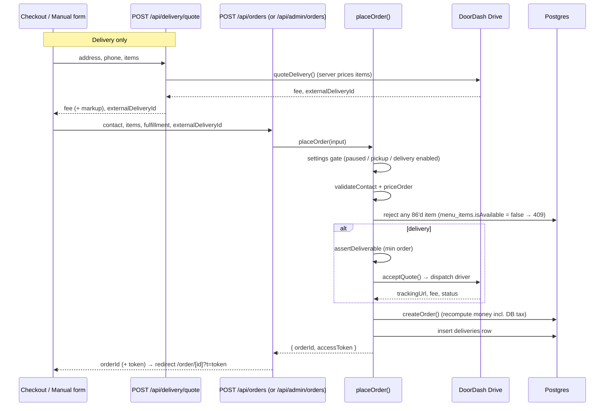
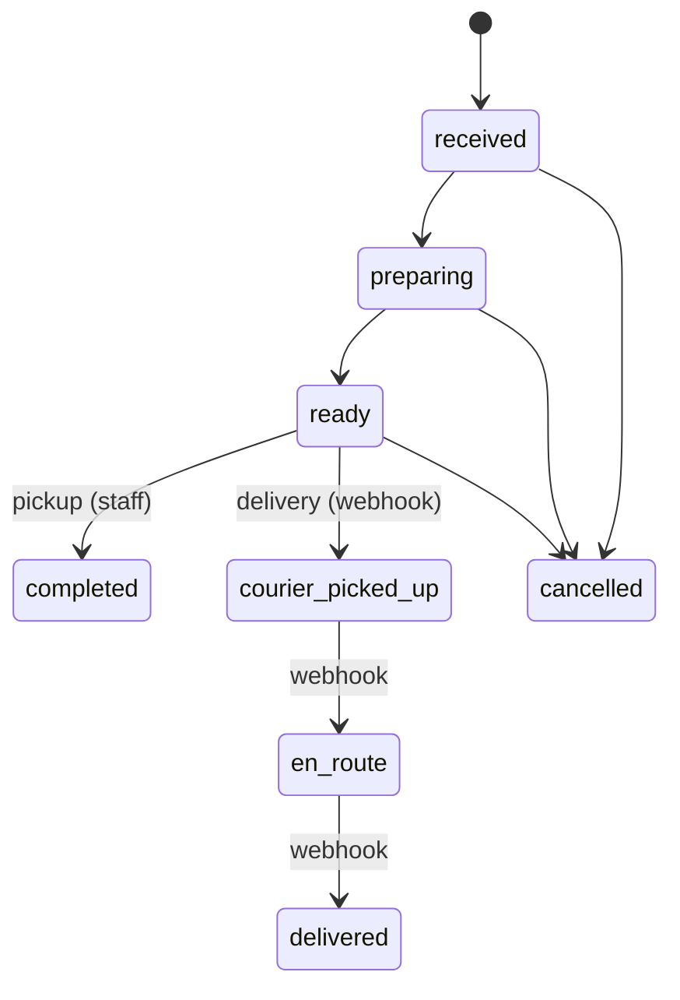

# Annapurna Oakland — Architecture & Maintainer Guide

The ordering site, kitchen/admin panel, and delivery integration for Annapurna
restaurant (Oakland, CA). This document is for developers who will maintain or
extend the system. It explains how the pieces fit, why key decisions were made,
and where the sharp edges are.

This is the **single source of truth** — architecture, how-to, onboarding, and
support are all here. New to the project? Jump to **§18 Developer Onboarding**.
On call / something's broken? Go to **§19 Support & Operations Runbook**.

> `docs/DOORDASH.md` is an optional deep-dive on the DoorDash provider (not the
> active courier — prod runs Uber, §9). Everything you need day-to-day is below.

## Contents

**Understand the system**
1. Stack · 2. System context · 3. Repository layout · 4. Auth & RBAC ·
5. Data model · 6. Ordering pipeline · 7. Menu & dish images · 8. Pricing &
settings · 9. Delivery providers (Uber/DoorDash/self) · 10. Frontend conventions

**Build & ship**
11. Local development · 12. Environment variables · 13. Deployment ·
14. Testing · 15. Roadmap · 16. Gotchas · 17. Redirects & SEO

**Operate**
18. Developer onboarding (day-1 → first PR) · 19. Support & operations runbook ·
20. Uber Direct go-live runbook

---

## 1. Stack

| Layer | Choice | Notes |
|-------|--------|-------|
| Framework | **Next.js 16.2.4** (App Router) | Server Components by default; route guard is `src/proxy.ts` (see §4) |
| UI | React 19.2.4, Tailwind + inline styles, shadcn/base-ui, `lucide-react`, `motion` | Dark "michelin" theme; design tokens are inline hex (see §10) |
| Data | **Drizzle ORM 0.45** over `postgres-js` | Single client in `src/db/index.ts`; schema in `src/db/schema.ts` |
| Database | **Supabase Postgres** | RLS on; app connects via pooler `DATABASE_URL` |
| Validation | `zod` (selective), hand-rolled validators in `src/lib/orders/pricing.ts` | |
| Tests | **Vitest** | `npm test`; needs a `server-only` shim (see §11) |
| Hosting | **Vercel** | Functions run the Node.js runtime; prod = `annapurnaoakland.vercel.app` |
| Delivery | **DoorDash Drive** or **Uber Direct** (selectable) + self-delivery | Provider chosen by `settings.delivery.dispatchMode`; quote → dispatch → webhook status (§9) |

> **Read `AGENTS.md` first.** This Next.js version has breaking changes vs.
> older docs. Route handler params are async (`{ params }: { params: Promise<…> }`),
> and the middleware file is `src/proxy.ts`, not `middleware.ts`.

---

## 2. System context


Two front-ends share one API and one database:

- **Public site** — menu, cart, checkout, order tracking. No auth; orders are
  read back via a per-order capability token (see §6).
- **Admin panel** (`/admin`) — live orders board, menu/promos/reservations/
  catering/staff CRUD, settings. Auth + RBAC required.

---

## 3. Repository layout

```
src/
  app/
    page.tsx                 Home (michelin "luxe" landing)
    menu/page.tsx            Public menu (static catalog + DB availability overlay)
    checkout/page.tsx        Cart → contact → delivery quote → place order
    order/[id]/page.tsx      Customer order tracking (+ embedded DoorDash map)
    about/ preview/          Marketing + design previews (not live ordering)
    admin/
      login/page.tsx         Staff login (outside the auth gate)
      (panel)/               Auth-gated route group — shares the admin shell
        layout.tsx           Header + role-gated nav tabs + sign out
        page.tsx             Orders board
        menu/ promos/ reservations/ catering/ staff/ settings/
    api/
      orders/                Public: POST place order, GET order-by-token
      reservations/          Public: POST a table reservation (admin board)
      catering/              Public: POST a catering request (admin inbox)
      delivery/quote/        Public: DoorDash delivery quote
      menu/availability/     Public: "86" (unavailable) item slugs
      settings/public/       Public-safe subset of settings
      doordash/webhook/      DoorDash → us: delivery status events
      uber/webhook/          Uber Direct → us: delivery status events
      admin/                 Auth-gated: orders, menu, promos, reservations,
                             catering, staff, settings
  lib/
    auth/                    password (scrypt), session (signed HMAC cookie)
    orders/                  pricing, status machines, place-order, delivery-pricing
    doordash/                jwt, client, webhook, types
    uber/                    Uber Direct: client (quote/dispatch/cancel), webhook
    settings/                typed settings folded over DB key/value rows
    dish-images.ts           name → /images/dishes/<key>.jpg matcher
    env.ts                   required() env accessors
  data/menu.ts               Static catalog (178 items) — source of truth for /menu
  db/
    index.ts schema.ts seed.ts seed-staff.ts
  components/
    admin/orders-board.tsx   Polling orders board: chime + voice + auto-print
    admin/kitchen-receipt.tsx 80mm thermal kitchen ticket (print-only; see §10)
    home/luxe/footer.tsx     Site footer (incl. embedded location map)
  proxy.ts                   Next 16 route guard for /admin + /api/admin
next.config.ts               Image remotePatterns + /order→/menu redirect (§17)
drizzle/migrations/          Drizzle-kit SQL migrations
public/images/dishes/        Self-hosted dish photos
scripts/                     One-off + ops scripts (images, doordash tests)
docs/                        This guide + DoorDash + kitchen-printing + specs/plans
```

---

## 4. Authentication & RBAC

Staff log in with **email + password**; a signed cookie carries the session.

**Password** — `src/lib/auth/password.ts`. Node `crypto` **scrypt**, no
dependency. `hashPassword(plain)` / `verifyPassword(plain, hash)`.

**Session** — `src/lib/auth/session-core.ts` (pure, Web Crypto) +
`src/lib/auth/session.ts` (cookie I/O via `next/headers`).

- Token = base64url payload + **HMAC-SHA256** signature, keyed by
  `STAFF_SESSION_SECRET`. Reuses the DoorDash JWT signing pattern.
- Cookie `annapurna_staff`, `httpOnly`, **8-hour** TTL (`SESSION_TTL_SECONDS`).
- `SessionPayload = { sid, role }`; `Role = "owner" | "manager" | "staff"`.

**Why split `session.ts` / `session-core.ts`?** `proxy.ts` runs in a context
where `next/headers` is unavailable. Keeping token sign/verify pure lets the
proxy import `session-core` directly.

**Route guard** — `src/proxy.ts` (Next 16's middleware; **named `proxy`, not
`middleware`**). Matches `/admin/:path*` and `/api/admin/:path*`:

- `/admin/login` passes through (avoids a redirect loop).
- No valid session → API gets `401`, pages redirect to `/admin/login`.

**Defense in depth.** The proxy is the gate, but each admin page and API route
*also* checks the role:

```ts
// server page
const session = await getSession();
if (!session || (session.role !== "owner" && session.role !== "manager")) redirect("/admin");

// API route
try { await requireRole(["owner", "manager"]); }
catch (e) { return NextResponse.json({ error: "Unauthorized" }, { status: e instanceof AuthError ? 401 : 500 }); }
```

**Role matrix** (from `admin/(panel)/layout.tsx` tabs):

| Area | owner | manager | staff |
|------|:-----:|:-------:|:-----:|
| Orders board | ✅ | ✅ | ✅ |
| Menu / Promos / Reservations / Catering / Settings | ✅ | ✅ | — |
| Staff management | ✅ | — | — |

**Bootstrap the first owner:** set `ADMIN_BOOTSTRAP_EMAIL` / `ADMIN_BOOTSTRAP_PASSWORD`,
then `npm run db:seed:staff` (idempotent — no-op if any owner exists).

---

## 5. Data model

All tables live in `src/db/schema.ts` (Drizzle). Highlights:

| Table | Purpose | Notes |
|-------|---------|-------|
| `staff` | Admin accounts | `passwordHash` (scrypt), `role`, `isActive`; never leaves the server |
| `orders` | Customer orders | `status`, `paymentStatus`, `paymentMethod`, `source`, `accessToken` (capability), money columns |
| `order_items` | Line items | FK → orders (cascade delete) |
| `deliveries` | DoorDash delivery per order | `externalDeliveryId` (unique), `status`, `trackingUrl`, `lastEventId` (idempotency), `raw` |
| `menu_categories` / `menu_items` | DB-managed menu | `slug` mirrors the static catalog `id`; `isAvailable` drives "86" |
| `reservations` | Table bookings | status lifecycle |
| `catering_requests` | Catering inbox | status + `adminNotes` + `quotedTotal` |
| `promos` | Discount codes | added in migration `0004` |
| `restaurant_settings` | Key/value (jsonb) settings | folded into typed `Settings` (see §8) |
| `customers`, `loyalty_*`, `time_slots` | Present, partially used | future loyalty / reservation capacity |

### Migrations — important caveat

The live Supabase database was provisioned largely via **`drizzle-kit push`**,
not the migration journal. So `drizzle/migrations/*` and the DB's
`__drizzle_migrations` table are **not** fully in sync.

- ✅ Apply schema changes with `npm run db:push`, or run targeted DDL directly.
- ❌ Do **not** run `drizzle-kit migrate` against the live DB — it would try to
  replay `0000…` and fail on already-existing tables.
- `npm run db:generate` is still fine to produce a migration file for review.

---

## 6. Ordering pipeline

Both the public checkout and the admin "manual/phone order" form funnel into one
shared function, `placeOrder` (`src/lib/orders/place-order.ts`). This guarantees
identical validation, pricing, dispatch, and persistence.



### Status state machines (`src/lib/orders/status.ts`)



- `PICKUP_FLOW = [received, preparing, ready, completed]`
- `DELIVERY_FLOW = [received, preparing, ready, courier_picked_up, en_route, delivered]`
- **Staff** advance up to `ready` (delivery) / `completed` (pickup). The
  courier states (`courier_picked_up`, `en_route`, `delivered`) are
  **webhook-only** — only DoorDash can set them.
- `canTransition(fulfillment, from, to, actor)` enforces this; `actor` is
  `"staff"` or `"webhook"`. `TERMINAL = {completed, delivered, cancelled}`.
- `cancelled` is reachable from any non-terminal state.

### Payment tracking

Orders carry `paymentStatus` (`unpaid|paid|refunded`) and `paymentMethod`
(`cash|card|online`), independent of fulfillment status. Staff toggle these via
`PATCH /api/admin/orders/[id]/payment` for cash/card at handoff.

**Stripe is integrated** for online prepayment. Public checkout uses Stripe
**Embedded Checkout** (`@stripe/react-stripe-js`); the order is persisted as
`pending_payment` and **no courier is dispatched** until Stripe confirms. The
`POST /api/stripe/webhook` handler (`src/lib/stripe/`) then calls
`dispatchPaidOrder` — an atomic, idempotent "flip to paid + received" that
dispatches the courier (re-quoting Uber fresh, since its quotes expire fast).
Refunds: `src/lib/orders/refund.ts` (+ `/api/admin/orders/[id]/refund`).

### Two entry paths

- **Immediate** (`placeOrder`) — manual/phone orders and pay-on-handoff:
  validate → price → dispatch courier → persist as `received`.
- **Online prepay** (`createPendingOrder` → Stripe → `dispatchPaidOrder`) —
  public card checkout: persist as `pending_payment` with **no** dispatch, then
  the Stripe webhook flips it to paid + `received` and dispatches the courier.

Both live in `src/lib/orders/place-order.ts` and share the same pricing/validation.

### Reading an order back (IDOR guard)

Orders contain PII. The public read requires the per-order capability token:

```
GET /api/orders/[id]?t=<accessToken>
```

`orders.accessToken` is a high-entropy UUID generated at insert. The admin
orders list **strips `accessToken`** before returning, so staff never leak the
capability token.

---

## 7. Menu & dish images

There are **two parallel menu systems** today. Know which one you're touching.

| | Public `/menu` | Admin `/admin/menu` |
|--|----------------|---------------------|
| Source | **static** `src/data/menu.ts` (178 items) | **DB** `menu_items` (CRUD) |
| Image | `dishImage(name, category)` at module load | `imageUrl` column |
| Join key | item `id` | item `slug` (=== static `id`) |

> Unifying these (public menu reading the DB) is roadmap **P3**. Until then,
> edits in the admin Menu page do **not** change the public menu's text/prices —
> only availability is bridged (see below).

### Images

`src/lib/dish-images.ts` maps a dish name to a **self-hosted** file under
`public/images/dishes/<key>.jpg`. Priority-ordered keyword matchers pick the key;
`menu.ts` overwrites each item's `image` with `dishImage(...)` at load.

- Photos are sourced from **Wikimedia Commons** (correct labels) and the
  restaurant's **DoorDash storefront** (real plating; DoorDash wins where it has
  a photo). All visually verified.
- Self-hosted (not hotlinked) → no rate limits, same-origin `next/image`, no
  `remotePatterns` needed.
- Re-fetch/re-verify with `scripts/fetch-dish-images.mjs`,
  `scripts/fetch-doordash-images.mjs`, `scripts/check-dish-images.ts`.

### Availability ("86" / sold-out)

The one piece that **is** bridged between DB and public site:

1. Admin toggles `menu_items.isAvailable` (`PATCH /api/admin/menu/items/[id]`).
2. `GET /api/menu/availability` returns the slugs where `isAvailable = false`
   (cached 15s).
3. `/menu` greys those cards with an "86 · Sold Out" overlay + disabled button.
4. `placeOrder` **rejects** any 86'd line server-side (`409`) — enforced
   regardless of the client UI.

Join is `menu_items.slug === static menu id`.

---

## 8. Pricing & settings

**Catalog pricing is server-authoritative.** Clients send `{ id, qty }` only;
`priceOrder` (`src/lib/orders/pricing.ts`) looks up prices from the static
catalog and computes subtotal/tax/total in cents. Never trust client prices.

**Settings** live in `restaurant_settings` (key/value jsonb) and are folded over
typed defaults by `mergeSettings` (`src/lib/settings/index.ts`). Bad/missing
values fall back to `DEFAULT_SETTINGS`.

```ts
interface Settings {
  tax_rate: number;            // default 0.0925; authoritative over pricing.ts fallback
  delivery: DeliverySettings;
  ordering_paused: boolean;    // kill switch for all online ordering
  pickup_enabled: boolean;
  delivery_enabled: boolean;
  dish_of_day: { itemId: string | null; discountPercent: number };
}
interface DeliverySettings {
  mode: "live" | "flat";       // live = courier fee + markup; flat = fixed fee
  flatFeeCents: number;
  markupCents: number;         // added to the live courier fee
  markupPercent: number;       // % added to the live courier fee
  freeThresholdCents: number;  // 0 = disabled; free delivery at/above this subtotal
  minOrderCents: number;       // delivery minimum (assertDeliverable)
  maxRadiusMiles: number;      // enforced via courier undeliverable rejection
  dispatchMode: "doordash" | "uber" | "self"; // which courier dispatches (§9)
}
```

**Delivery fee** — `computeDeliveryFee` (`src/lib/orders/delivery-pricing.ts`):

- `flat` → `flatFeeCents`.
- `live` → `doordashFeeCents + markupCents + round(doordashFeeCents * markupPercent/100)`.
- Free when `freeThresholdCents > 0 && subtotal >= freeThresholdCents`.

`assertDeliverable` throws `MinOrderError` below `minOrderCents`. Radius isn't
geocoded in-app — DoorDash rejects undeliverable dropoffs at quote/accept time.

Admins edit all of this at **`/admin/settings`** → `PATCH /api/admin/settings`.

---

## 9. Delivery providers

Delivery dispatch is **provider-selectable** via `settings.delivery.dispatchMode`
(admin Settings). One order schema (`deliveries` row) serves all three:

| `dispatchMode` | Behavior |
|----------------|----------|
| `doordash` (default) | DoorDash Drive: client holds an `externalDeliveryId` from the quote; `placeOrder` calls `acceptQuote` to dispatch. |
| `uber` | Uber Direct: `placeOrder` calls `createUberQuote` then `createUberDelivery` to dispatch (no client-held id). |
| `self` | Restaurant delivers: flat fee only, no courier API call. |

> **Production currently runs `uber`** with `mode: "flat"` (customer pays a flat
> $6.99 delivery fee; Uber still dispatches the driver). `doordash` is the code
> default and stays wired as a fallback. Change both in admin **Settings**.

Both the public quote (`POST /api/delivery/quote`) and `placeOrder` branch on
`dispatchMode`, so pricing and dispatch always agree. `computeDeliveryFee` applies
the admin markup on top of whichever courier fee comes back (the field is still
named `doordashFeeCents` for historical reasons — it carries the Uber fee too).

**Uber Direct** (`src/lib/uber/`):

- **Client** `client.ts`: `createUberQuote`, `createUberDelivery` (= dispatch),
  `getUberDelivery`, `cancelUberDelivery`. OAuth via `UBER_CLIENT_ID` /
  `UBER_CLIENT_SECRET` / `UBER_CUSTOMER_ID`.
- **Webhook** `POST /api/uber/webhook`: verifies `X-Uber-Signature`
  (HMAC-SHA256 of the raw body, keyed by `UBER_SIGNING_KEY`, falling back to the
  client secret), maps Uber status → order status via `mapUberStatus` +
  `canTransition(actor="webhook")`.
- **Refund/cancel** (`src/lib/orders/refund.ts`): on a full refund of a
  not-yet-picked-up delivery, the provider is inferred from the id —
  `anp-…` → `cancelDelivery` (DoorDash), otherwise `cancelUberDelivery`.

**DoorDash Drive** — full detail + production cutover in
[`docs/DOORDASH.md`](./DOORDASH.md). In brief:

- **Auth** — `src/lib/doordash/jwt.ts`: HS256 JWT, `DD-JWT-V1`, 5-min expiry,
  from `DOORDASH_DEVELOPER_ID` / `_KEY_ID` / `_SIGNING_SECRET`.
- **Client** — `src/lib/doordash/client.ts`: `quoteDelivery`, `acceptQuote`
  (= dispatch), `getDelivery`.
- **Dispatch** — `placeOrder` calls `acceptQuote` for delivery orders, then
  saves the `deliveries` row (`trackingUrl`, `status`).
- **Webhook** — `POST /api/doordash/webhook` authenticates by **Authorization
  header token** (`DOORDASH_WEBHOOK_SECRET`) *or* HMAC `x-doordash-signature`,
  maps `delivery_status` → order status via `canTransition(actor="webhook")`,
  idempotent on `lastEventId`.
- **Customer tracking** — `/order/[id]` embeds DoorDash's tracking page in an
  iframe (their `frame-ancestors *` allows it) plus an "Open fullscreen" link.
- **Sandbox quirks** — deliveries don't auto-advance; store shows as
  `business_owner`; every address shows "Address needs review". All gone in
  production.

---

## 10. Frontend conventions

- **Design tokens are inline hex**, not a Tailwind theme. Common values:
  - Page bg `#14100D`, card bg `#1C1712`, gold accent `#C9A24B`,
    cream text `#F3E9D6`, muted `#8A8276`, card border `rgba(201,162,75,0.18)`.
  - Display headings: `fontFamily: var(--font-display)`, `fontWeight: 200`.
- **Admin pages** = server component (auth + data) rendering a `"use client"`
  component that fetches `/api/admin/...` for data and mutations. Match the
  existing card/input/button styles when adding pages.
- The orders board polls every 10s and, on new orders, plays a WebAudio chime,
  a spoken announcement (Web Speech), and **auto-prints a kitchen ticket**.

### Kitchen ticket printing

**Primary: CloudPRNT (Star network printer).** `src/app/api/cloudprnt/route.ts`
implements the Star CloudPRNT protocol. A Star LAN printer (TSP650II) polls it
(`POST` → `{jobReady,jobToken}`, `GET` → ticket as `application/vnd.star.line`
from `src/lib/print/star-line.ts`, `DELETE` → stamps `kitchen_printed_at`).
Tickets print **on accept**: an order is printable only once staff move it
`received → preparing` and `kitchen_printed_at IS NULL`. The printer reaches
*out* to the server, so it works behind the restaurant's NAT with the app on
Vercel — no on-site computer, tablet, or Bluetooth. Auth is HTTP Basic
(`CLOUDPRNT_TOKEN`). New orders trigger a **looping alarm** on the board
(`orders-board.tsx`) that repeats every ~3s until accepted. Full setup:
[`docs/KITCHEN-PRINTING.md`](./KITCHEN-PRINTING.md).

**Fallback: browser board auto-print (window.print).**
`src/components/admin/kitchen-receipt.tsx` renders an 80mm thermal ticket into a
hidden `#kitchen-receipt` element; `globals.css` `@media print` isolates it and
sets `@page { size: 80mm auto }`. The orders board queues each new `received`
order and prints it via `window.print()`, one at a time (`afterprint`-driven).

- A persistent `localStorage` set (`annapurna:admin:printed`, capped 800) makes
  each ticket print **once** — reloads / second tabs never reprint. The first
  poll after load seeds existing orders as "printed" so the backlog isn't dumped.
- Auto-print is **off by default**, toggled per device (so staff phones don't
  pop print dialogs). Each card also has a manual **Print** (reprint) button.
- Silent printing needs Chrome `--kiosk-printing` on the on-site machine with
  the Star TSP100 as the default printer. Full setup + troubleshooting:
  [`docs/KITCHEN-PRINTING.md`](./KITCHEN-PRINTING.md).

---

## 11. Local development

```bash
git clone <repo>
cp .env.example .env.local        # fill in the values from §12
npm install
npm run db:seed:staff             # create the first owner (needs ADMIN_BOOTSTRAP_*)
npm run dev                       # http://localhost:3000
```

Other commands:

```bash
npm test            # vitest
npm run build       # production build
npm run db:push     # sync schema.ts → live DB (preferred over migrate; see §5)
npm run db:generate # generate a migration file for review
npm run db:studio   # drizzle studio
```

**`server-only` shim for scripts.** `src/lib/env.ts` imports `server-only`,
which only resolves inside Next's build. Vitest aliases it (see
`vitest.config.ts`). To run a `tsx` script that transitively imports `env.ts`:

```bash
NODE_OPTIONS="--require $(pwd)/scripts/_server-only-shim.cjs" \
  npx tsx --env-file=.env.local scripts/<name>.ts
```

---

## 12. Environment variables

| Variable | Required | Used by |
|----------|:--------:|---------|
| `DATABASE_URL` | ✅ | Drizzle / Postgres (Supabase pooler) |
| `STAFF_SESSION_SECRET` | ✅ | Session token signing (`session-core.ts`) |
| `NEXT_PUBLIC_SUPABASE_URL` | ✅ | Client Supabase URL |
| `NEXT_PUBLIC_SUPABASE_ANON_KEY` | ✅ | Client Supabase anon key |
| `SUPABASE_SERVICE_ROLE_KEY` | ✅ | Server-side Supabase (`env.supabase()`) |
| `STRIPE_SECRET_KEY` | ✅ | Stripe charges/refunds (`env.stripe()`) |
| `STRIPE_WEBHOOK_SECRET` | ✅ | Stripe webhook signature verification |
| `NEXT_PUBLIC_STRIPE_PUBLISHABLE_KEY` | ✅ | Client Stripe.js (checkout) |
| `DOORDASH_DEVELOPER_ID` | ✅ (DoorDash) | Drive JWT |
| `DOORDASH_KEY_ID` | ✅ (DoorDash) | Drive JWT |
| `DOORDASH_SIGNING_SECRET` | ✅ (DoorDash) | Drive JWT |
| `DOORDASH_WEBHOOK_SECRET` | ✅ (DoorDash) | Webhook auth token / HMAC |
| `UBER_CLIENT_ID` / `UBER_CLIENT_SECRET` / `UBER_CUSTOMER_ID` | ✅ (Uber mode) | Uber Direct OAuth + dispatch (`env.uber()`) |
| `UBER_SIGNING_KEY` | ✅ (Uber mode) | Uber webhook `X-Uber-Signature` HMAC (falls back to client secret) |
| `RESTAURANT_PICKUP_ADDRESS` | ✅ (delivery) | Courier pickup |
| `RESTAURANT_PICKUP_PHONE` | ✅ (delivery) | Courier pickup |
| `GOOGLE_GEOCODING_API_KEY` | optional | Address geocoding (`env.geocoding()`) |
| `GOOGLE_REVIEW_URL` | optional | GBP "leave a review" link; when set, completed orders auto-send a review request (email + SMS) — `sendReviewRequest` in `src/lib/notify` |
| `SENDGRID_API_KEY` / `EMAIL_FROM` / `RESTAURANT_NOTIFY_EMAIL` | optional | Order email notifications |
| `TWILIO_ACCOUNT_SID` / `TWILIO_AUTH_TOKEN` / `TWILIO_FROM` / `RESTAURANT_NOTIFY_PHONE` | optional | Order SMS notifications |
| `NEXT_PUBLIC_BASE_URL` | optional | Absolute URLs (defaults to localhost) |
| `CLOUDPRNT_TOKEN` | optional (kitchen printing) | HTTP Basic password the Star network printer sends to `/api/cloudprnt` (CloudPRNT). Primary kitchen-print path; orders print on accept. Blank = 401 |
| `PRINT_BRIDGE_TOKEN` | optional (print bridge, unused) | Bearer auth for the Android kitchen print bridge — `GET /api/print/pending`, `POST /api/print/ack` (`src/lib/print/auth.ts`). Superseded by CloudPRNT |
| `ADMIN_BOOTSTRAP_EMAIL` / `ADMIN_BOOTSTRAP_PASSWORD` | seed only | `db:seed:staff` |

`env.doordash()` and `env.stripe()` use `required()` — they throw if any of their
vars is missing the moment that accessor runs. `env.uber()` reads with `?? ""`
defaults, so set the Uber vars whenever `dispatchMode` is `uber`. All accessors
live in `src/lib/env.ts`.

> **Secrets policy:** never commit secrets or print them. To push to Vercel
> without echoing the value:
> `printf '%s' "$VALUE" | npx vercel env add NAME production`

---

## 13. Deployment

Hosted on **Vercel** (`annapurnaoakland.vercel.app`). API routes use the
Node.js runtime (`export const runtime = "nodejs"`).

- Push env vars with `vercel env add <NAME> production` (and `preview`).
  Preview in CLI v53 may need a branch arg.
- **New env vars require a redeploy** to reach functions: `npx vercel --prod`.
- **Branch flow:** `main` → production (`annapurnaoakland.com`), `dev` →
  staging (`dev.annapurnaoakland.com`, Preview env). Feature branches merge to
  `main` fast-forward. Full staging setup in [`../DEV.md`](../DEV.md).

---

## 14. Testing

Vitest, colocated `*.test.ts`. Covered: scrypt password, session sign/verify,
order pricing, status machines, delivery pricing, settings folding, webhook
status mapping. Run `npm test`. Add tests beside the unit under change.

DoorDash has runnable **sandbox** scripts (no unit mocks):
`scripts/doordash-smoke.ts` (quote → accept → status) and
`scripts/doordash-e2e.ts` (quote → place + persist → poll). See `docs/DOORDASH.md`.

---

## 15. Roadmap status

| Phase | Scope | Status |
|-------|-------|:------:|
| P0 | Auth/RBAC + admin shell | ✅ |
| P1 | Settings + pricing-to-DB (tax, delivery) | ✅ |
| P2 | Live order management (DB board, state machines, manual orders, payments) | ✅ |
| P3 | Menu CRUD + **unify public menu onto the DB** | partial (CRUD ✅, public still static) |
| P4 | Hours/closures + reservations + catering inbox | ✅ (admin + public `/reservations` & `/catering` pages → admin board/inbox) |
| P5 | Promos / discounts (new `promos` table) | ✅ (CRUD; not yet applied at checkout) |
| P6 | Stripe payments + refunds | ✅ (embedded checkout, webhook → prepay dispatch, refunds; §6/§8) |
| — | DoorDash Drive dispatch + tracking | ✅ (sandbox verified; prod cutover pending) |
| — | Uber Direct dispatch + tracking (`dispatchMode: "uber"`) | ✅ (§9) |
| — | Kitchen ticket auto-printing (80mm thermal) | ✅ (browser kiosk-printing; §10) |
| — | Footer location map + `/order`→`/menu` SEO redirect | ✅ |

---

## 16. Gotchas (read before you debug)

1. **Middleware is `src/proxy.ts`**, not `middleware.ts` (Next 16).
2. **Two menu sources** — `/menu` is static; admin Menu edits the DB. Only
   availability is bridged. Don't expect price/name edits to show publicly yet.
3. **`dishImage()` overwrites** `menu.ts` item images at load
   (`src/data/menu.ts` last line). The hardcoded `image` fields are dead.
4. **Migrations ≠ live DB journal.** Use `db:push` or targeted DDL, never
   `drizzle-kit migrate` against prod (see §5).
5. **`server-only`** breaks `tsx` scripts — use the shim (§11).
6. **`externalDeliveryId` format** is strict: `^anp-[0-9a-f-]{36}$`
   (`anp-` + a UUID). Other formats are rejected by `placeOrder`.
7. **Availability is cached 15s** — admin toggles take up to ~15s on `/menu`.
8. **Order reads need `?t=<accessToken>`** — no token, no order.
9. **DoorDash sandbox doesn't move drivers** — status only advances in prod or
   via manually POSTed webhook events.
10. **`/order` is not a page** — only `/order/[id]` (tracking) exists. The bare
    `/order` URL is 308-redirected to `/menu` in `next.config.ts` (§17); don't
    add an `order/page.tsx` without removing that redirect.
11. **`/menu` prerenders against the DB at build time** (`revalidate=30`, calls
    `getMenuCatalog()`). Preview env vars are scoped to the **`dev` branch only**,
    so a preview deploy on any *other* branch builds with no `DATABASE_URL` and
    would otherwise fail at the `/menu` prerender (`ECONNREFUSED 127.0.0.1:5432`).
    `getMenuCatalog()` guards this: during the build phase
    (`NEXT_PHASE === "phase-production-build"`) an unreachable DB degrades to an
    empty catalog and ISR hydrates it at runtime. To get real data on a
    feature-branch preview, widen the Preview env var scope to all branches
    (Vercel → Settings → Environment Variables).

---

## 17. Redirects & SEO

`next.config.ts` holds non-image platform config:

- **`/order` → `/menu`** (permanent 308). Google had indexed the bare `/order`
  URL, which 404s (no index page — only `/order/[id]` tracking exists). The
  redirect reclaims that traffic. Exact match, so `/order/[id]` is untouched.
  Because `/order` was the old ordering landing page, `/menu` now owns
  "order online" search intent: its title (`Order Online — Indian & Nepalese
  Menu`), meta description, OpenGraph, and H1 (`Order online.`) lead with ordering
  — see `src/app/menu/layout.tsx` + `src/app/menu/page.tsx`.
- **`/menu` is server-rendered.** It was a `"use client"` page that fetched the
  menu from `/api/menu` after hydration, leaving an empty server HTML body →
  Google flagged it **Soft 404** and would not index it. `src/app/menu/page.tsx`
  is now a server component that seeds the catalog from `getMenuCatalog()` (ISR
  `revalidate=30`) into the client component `src/app/menu/menu-client.tsx`, which
  still refreshes live availability from `/api/menu`. Keep new menu UI interactive
  bits in `menu-client.tsx`; keep data-seeding server-side in `page.tsx`.
- Add future path redirects to the same `redirects()` array. Redirects run
  before the filesystem and need a build/deploy to take effect.

Other SEO surfaces: `src/app/sitemap.ts` (home, menu, reservations, catering,
about), `src/app/robots.ts` (disallows `/admin`, `/checkout`, `/order/`, `/api/`,
and `/preview` + `/flyer` — the latter two are non-public / duplicate-design
content), JSON-LD in `src/components/seo/restaurant-jsonld.tsx` (Restaurant
schema; hours derived from `src/lib/orders/hours.ts` so they never drift; real
`aggregateRating` + reviews from the Google Places API via
`src/lib/reviews/google.ts` — emitted only when real data exists, and the output
escapes `<` because review text is third-party; `sameAs` links the verified
Google/Yelp/Facebook/Instagram/Grubhub profiles — the `SAME_AS` constant — so
Google ties the site to the business's listings in the knowledge graph for local
ranking, kept in sync with the footer's social links) and
`src/components/seo/menu-jsonld.tsx` (Menu schema with dish prices, on `/menu`),
plus metadata in `src/app/layout.tsx`. Per-page `metadata` exports carry local
keywords.
The **home footer** (`src/components/home/luxe/footer.tsx`) shows the address +
a keyless Google Maps embed (`output=embed`, no API key) linking to directions,
plus Instagram / Facebook / Yelp profile links (the `SOCIALS` constant, mirroring
the schema `sameAs`).

---

## 18. Developer onboarding (day-1 → first PR)

Welcome. This section takes a new developer from zero to a shipped change. Read
§1–§10 first for the "why"; this is the "how".

### 18.1 Access you'll need

Ask the owner to grant these before you start. Without them you can read code but
can't run or ship the app.

| System | Why | How to get it |
|--------|-----|---------------|
| **GitHub** repo (`torpedo88/annapurnaoakland`) | Code + PRs | Repo collaborator invite |
| **Vercel** project | Deploys, logs, env vars | Team member invite |
| **Supabase** (prod + dev projects) | Database, SQL editor | Org invite (prod ref + dev ref) |
| **Stripe** dashboard | Payments, refunds, webhook secret | Account invite (use **Test mode** for dev) |
| **Uber Direct** (developer + Direct dashboard) | Live courier (primary), test mode | Org invite |
| **DoorDash** developer portal | Fallback courier (optional) | Org invite |
| **Domain DNS** (Wix) | `dev.` subdomain, mail | Owner adds records for you |
| **Google Cloud** | Maps/geocoding API key | Owner shares key + adds referrers |
| **Secrets** (`.env` values) | Local + Vercel config | Pull from Vercel (`vercel env pull`) or owner's secret store — **never** paste secrets into chat, commits, or this doc |

### 18.2 Local setup (≈15 min)

Prereqs: **Node.js 20+**, **git**, and the **Vercel CLI** (`npm i -g vercel`).

```bash
git clone git@github.com:torpedo88/annapurnaoakland.git
cd annapurnaoakland
npm install

# Get env values. Easiest: pull the dev/preview set from Vercel.
vercel link                       # select the annapurnaoakland project
vercel env pull .env.local        # writes the linked env into .env.local
# …or copy .env.example → .env.local and fill from the owner's secret store.

npm run db:seed:staff             # creates the first owner (needs ADMIN_BOOTSTRAP_* set)
npm run dev                       # http://localhost:3000
```

- Public site: <http://localhost:3000>  ·  Admin: <http://localhost:3000/admin>
- Log in with `ADMIN_BOOTSTRAP_EMAIL` / `ADMIN_BOOTSTRAP_PASSWORD`.
- **Point local at the dev DB + test keys**, never prod (see [`../DEV.md`](../DEV.md)).
  Use Stripe **test mode** (card `4242 4242 4242 4242`) and Uber **test** creds
  (simulated "robocourier"). You should never trigger a real charge or driver
  from a laptop.

If the app throws `Missing required env var: X` on boot, that accessor in
`src/lib/env.ts` needs `X` set — fill it in `.env.local` (see §12).

### 18.3 The 5-minute mental model

- **Two front-ends, one API, one DB** (§2). Public site (no auth, capability-token
  order reads) + admin panel (session + RBAC).
- **Server is authoritative.** Prices come from `src/data/menu.ts` via
  `priceOrder`; clients send `{id, qty}` only. Settings (tax, delivery, pause)
  live in the DB and gate every order (§8).
- **Delivery is pluggable** by `settings.delivery.dispatchMode` — Uber (prod
  default), DoorDash, or self (§9).
- **One funnel for orders:** `placeOrder` (immediate) and `createPendingOrder` →
  Stripe webhook → `dispatchPaidOrder` (online prepay). Same pricing/validation (§6).
- **The route guard is `src/proxy.ts`**, not `middleware.ts` (Next 16).

### 18.4 Golden paths — how to make common changes

Each lists the files to touch. Match the surrounding style; add/adjust tests.

1. **Edit a menu item's name/price/description** → `src/data/menu.ts` (the
   public `/menu` is static). Remember the DB `menu_items` table is a *separate*
   system used only for availability today (§7) — don't expect admin Menu edits
   to change public text/price yet.
2. **Change tax, delivery fee, pause ordering, switch courier** → no code:
   admin **Settings** (`/admin/settings`) writes `restaurant_settings`. Defaults
   and validation live in `src/lib/settings/index.ts`; the fee math in
   `src/lib/orders/delivery-pricing.ts` (§8).
3. **Add an admin page** → create `src/app/admin/(panel)/<name>/page.tsx` as a
   server component that checks the session/role, rendering a `"use client"`
   component that talks to `/api/admin/<name>`. Add the tab (role-gated) in
   `admin/(panel)/layout.tsx`. Copy an existing page (e.g. `promos`) for the
   pattern (§4, §10).
4. **Add an admin API route** → `src/app/api/admin/<name>/route.ts`. Start with
   `await requireRole([...])`, remember **params are async**
   (`{ params }: { params: Promise<{ id: string }> }`), and never return secrets
   (the orders list strips `accessToken`, §6).
5. **Change the order status flow** → `src/lib/orders/status.ts` (state machines
   + `canTransition`). Staff may advance only to `ready`/`completed`; courier
   states are webhook-only. Update the colocated `status.test.ts` (§6).
6. **Add/replace a delivery provider** → follow the `dispatchMode` pattern (§9):
   a client module under `src/lib/<provider>/` (quote/dispatch/cancel + webhook),
   a branch in `POST /api/delivery/quote` and in `placeOrder`, and a webhook
   route mapping statuses through `canTransition(actor="webhook")`.
7. **Add a new env-backed secret** → add an accessor in `src/lib/env.ts`
   (`required()` for must-have, `?? ""` for optional), document it in §12, and
   push it to Vercel (§13 / §19.5).

### 18.5 Definition of done (before you open a PR)

```bash
npm test            # vitest — add/adjust tests next to the unit you changed
npx tsc --noEmit    # types clean
npm run build       # production build + lint pass
```

- **Update the docs in the same change** — required (see `AGENTS.md`): this file,
  `README.md`, and any feature doc. Stale docs are treated as a bug.
- Match existing conventions: inline-hex design tokens (§10), the server-page +
  client-component admin pattern, async route params.
- **No secrets** in code, commits, or output. Branch off `main`; never commit to
  `main` directly without a green build.

### 18.6 Branch & ship workflow

```bash
git checkout main && git pull
git checkout -b feat/<short-name>
# …change code + tests + docs; run the DoD checks above…
git push -u origin feat/<short-name>
# open a PR, or fast-forward merge to main when approved:
git checkout main && git merge --ff-only feat/<short-name> && git push origin main
```

- **`main` → production** (`annapurnaoakland.com`); **`dev` → staging**
  (`dev.annapurnaoakland.com`). Vercel auto-deploys on push. Verify on staging
  before merging to `main` for anything risky (§13, [`../DEV.md`](../DEV.md)).

### 18.7 First-week checklist

- [ ] Local app + admin login working against the **dev** DB.
- [ ] Placed a **test** pickup order and a **test** delivery order (Uber test mode).
- [ ] Ran `npm test` green; opened a tiny doc/typo PR end-to-end.
- [ ] Skimmed §16 Gotchas and §19 Support runbook.
- [ ] Know how to read prod logs (§19.4) and run a read-only prod DB query (§19.5).

---

## 19. Support & operations runbook

For whoever is on call. **Golden rule: diagnose on staging/logs first; never run
write queries or experiments against the prod DB.**

### 19.1 Production facts

| | Value |
|--|--|
| Public site | `https://annapurnaoakland.com` |
| Admin | `https://annapurnaoakland.com/admin` |
| Host | Vercel (project `annapurnaoakland`) |
| DB | Supabase Postgres (prod project; ref in the Supabase org / Vercel `DATABASE_URL`) |
| Primary courier | **Uber Direct**, flat **$6.99** customer fee (`dispatchMode: uber`, §9) |
| Payments | Stripe (live), embedded checkout + webhook (§6/§8) |
| Kitchen printing | On-site Chrome `--kiosk-printing` → Star TSP100 ([`KITCHEN-PRINTING.md`](./KITCHEN-PRINTING.md)) |

### 19.2 Incident playbooks (symptom → diagnose → fix)

**1. Orders aren't appearing on the kitchen board.**
- Diagnose: is online ordering paused? Check admin **Settings** →
  `ordering_paused`, `pickup_enabled`, `delivery_enabled`. Hit
  `GET /api/admin/orders?lane=active` (logged in). Check the board is on the
  *Active* lane and the tab actually polls (every 10s).
- Fix: unpause in Settings (no deploy). If the API 500s, see incident #5.

**2. New orders aren't printing.**
- Diagnose: confirm **🖨 Auto-print on** is lit on the kiosk; that Chrome was
  launched with `--kiosk-printing`; the TSP100 is the **default** printer and has
  paper. A non-kiosk browser shows a dialog instead of printing.
- Fix / details + flags: [`KITCHEN-PRINTING.md`](./KITCHEN-PRINTING.md). Reprint
  any order with the per-card **🖨 Print** button.

**3. Delivery orders aren't getting a driver.**
- Diagnose: Vercel runtime logs for `[placeOrder] Uber dispatch failed` or
  `[quote] Uber quote failed` (§19.4). Common causes: missing/expired Uber creds,
  Uber test-mode creds in prod (or vice-versa), address Uber can't service, or an
  **expired quote** (Uber quotes are short-lived — `dispatchPaidOrder` re-quotes
  on purpose; a manual flow that reuses a stale quote will fail).
- Fix: correct the `UBER_*` env (§19.5) + redeploy; or temporarily switch
  **Settings → dispatch mode** to `self` (flat fee, you deliver) to keep taking
  orders while the courier issue is resolved. `doordash` is the other fallback.

**4. A customer paid but the order is stuck `pending_payment`.**
- Diagnose: the Stripe **webhook** didn't reach `dispatchPaidOrder`. Check Stripe
  Dashboard → Developers → Webhooks for failed deliveries to
  `/api/stripe/webhook`, and that `STRIPE_WEBHOOK_SECRET` in Vercel matches that
  endpoint's signing secret. Check Vercel logs for the webhook route.
- Fix: re-send the event from the Stripe dashboard once the secret is correct.
  `dispatchPaidOrder` is idempotent (atomic "flip to paid" claim), so replays are
  safe. Refund from Stripe if the order can't be fulfilled.

**5. The whole site returns 500.**
- Diagnose: almost always a **missing/incorrect env var** in prod — an
  `env.ts` `required()` throws at runtime. Check the most recent deploy's build
  logs and runtime logs (§19.4). (This exact failure has happened before when
  prod env vars were empty.)
- Fix: set the missing var (§19.5) and **redeploy** — env changes don't reach
  running functions until a new deploy. If a bad deploy caused it, **roll back**
  (§19.6).

**6. One page/route is broken or the build failed.**
- Diagnose: Vercel deploy → build logs. Reproduce locally with `npm run build`.
- Fix: patch on a branch, verify build, ship. If prod is broken *now*, roll back
  to the last good deploy first (§19.6), then fix forward.

**7. Pause ordering (closed early / kitchen slammed / courier outage).**
- Admin **Settings**: toggle `ordering_paused` (kills all online ordering) or
  `delivery_enabled` / `pickup_enabled` individually. Takes effect immediately,
  no deploy. `placeOrder` enforces these server-side.

**8. Refund a customer.**
- Admin order card → **Refund** (online-paid orders). Backed by
  `POST /api/admin/orders/[id]/refund` → Stripe refund; a full refund of a
  not-yet-picked-up delivery also cancels the courier (`src/lib/orders/refund.ts`).

### 19.3 Routine operations

- **Deploy:** push to `main` (auto) or `npx vercel --prod --yes`.
- **Check status:** `npx vercel ls` (recent deploys) / Vercel dashboard.
- See §19.4–§19.6 for logs, env, and rollback.

### 19.4 Logs & monitoring

- **Runtime logs** (function errors, our `console.error`): Vercel dashboard →
  project → Logs, or `npx vercel logs <deployment-url>`. All our handlers log
  with bracketed prefixes (`[placeOrder]`, `[quote]`, `[dispatchPaidOrder]`).
- **Build logs:** the deployment's page in the Vercel dashboard.
- **Stripe / Uber dashboards** have their own webhook delivery + request logs —
  use them to confirm whether an event ever reached us.

### 19.5 Manage env vars (safely)

```bash
npx vercel env ls                                   # names + scopes (no values)
printf '%s' "$VALUE" | npx vercel env add NAME production   # add without echoing
npx vercel env rm NAME production
npx vercel --prod --yes                             # redeploy so functions see it
```

Scope dev values to **preview** only (§13, DEV.md). **Never** paste a secret into
a commit, PR, this doc, or chat. If a secret is exposed, rotate it at the provider
and update Vercel + `.env`.

### 19.6 Roll back a bad deploy

- Vercel dashboard → Deployments → pick the last known-good → **Promote to
  Production** (instant, no rebuild). Or `npx vercel rollback`.
- Then fix forward on a branch.

### 19.7 Query the prod DB (read-only, no secret leak)

`psql` isn't installed locally; use a throwaway Node script **inside the repo**
(so `postgres` resolves) and load the URL without printing it:

```bash
cat > ._q.mjs <<'EOF'
import postgres from "postgres";
const sql = postgres(process.env.DBURL, { ssl: "require" });
console.log(await sql`select key, value from restaurant_settings`);
await sql.end();
EOF
export DBURL=$(grep -E '^DATABASE_URL=' .env.prod | head -1 | cut -d= -f2- | tr -d '"'"'"'')
node ._q.mjs && rm -f ._q.mjs        # never `echo $DBURL`
```

Keep it to **read-only** `select`s. Schema lives in `src/db/schema.ts`; for a UI
use Supabase's SQL editor or `npm run db:studio` against the right DB.

### 19.8 Escalation

App/code/deploy issues → the maintaining developer. Payment disputes → Stripe
dashboard + owner. Courier/delivery disputes → Uber Direct support + owner.
Restaurant ops (hours, pause, menu availability) → owner via the admin panel.

---

## 20. Uber Direct go-live runbook

Uber is the **active** courier (§9). Use this to (re)configure it or move a fresh
environment from test → production.

**Mechanics** (`src/lib/uber/client.ts`): client-credentials OAuth at
`https://auth.uber.com/oauth/v2/token` (scope `eats.deliveries`, token cached
~30 days), then `POST https://api.uber.com/v1/customers/{UBER_CUSTOMER_ID}/…` for
quote → delivery → cancel. Webhooks hit `POST /api/uber/webhook`, verified by the
`X-Uber-Signature` HMAC (§9).

**Env vars** (§12): `UBER_CLIENT_ID`, `UBER_CLIENT_SECRET`, `UBER_CUSTOMER_ID`,
`UBER_SIGNING_KEY`, plus `RESTAURANT_PICKUP_ADDRESS` / `RESTAURANT_PICKUP_PHONE`.

**Going live — checklist:**

1. In the Uber Direct dashboard, get **production** Customer ID / Client ID /
   Client Secret (test mode dispatches a simulated "robocourier"; production
   dispatches a real driver and charges).
2. Set the four `UBER_*` vars in Vercel **production** scope (§19.5); keep test
   creds in **preview**. Redeploy.
3. Register the webhook URL `https://annapurnaoakland.com/api/uber/webhook` in the
   Uber dashboard; copy its signing key into `UBER_SIGNING_KEY`.
4. In admin **Settings**, set dispatch mode to **Uber** and choose the customer
   fee model (prod uses `mode: flat`, $6.99).
5. Verify: place one real low-value delivery order; confirm a driver is assigned,
   the tracking URL works, and webhook status updates land on the order.

**Rollback:** flip **Settings → dispatch mode** to `self` (you deliver, flat fee)
or `doordash` — instant, no deploy. No code change needed to switch couriers.

**Troubleshooting:** see §19.2 incident #3. Most failures are credential
mismatch (test vs prod), an unserviceable address, or a stale quote.
