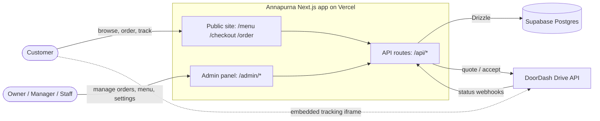
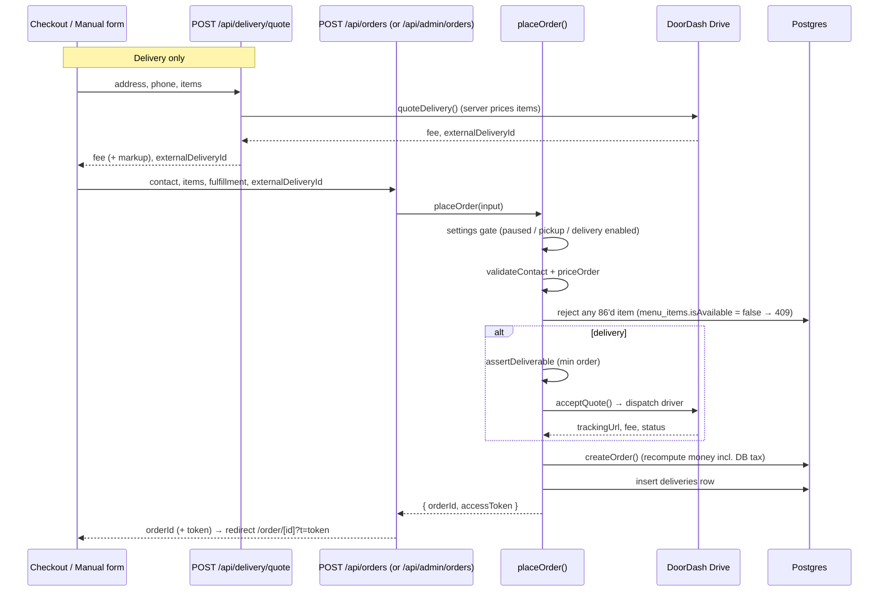
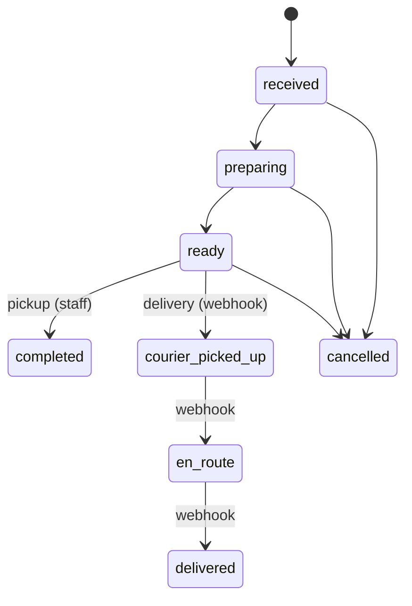

# Annapurna Oakland — Architecture & Maintainer Guide

The ordering site, kitchen/admin panel, and delivery integration for Annapurna
restaurant (Oakland, CA). This document is for developers who will maintain or
extend the system. It explains how the pieces fit, why key decisions were made,
and where the sharp edges are.

> DoorDash Drive has its own deep-dive + production cutover runbook:
> [`docs/DOORDASH.md`](./DOORDASH.md).

---

## 1. Stack

| Layer | Choice | Notes |
|-------|--------|-------|
| Framework | **Next.js 16.2.4** (App Router) | Server Components by default; route guard is `src/proxy.ts` (see §4) |
| UI | React 19.2.4, Tailwind + inline styles, shadcn/base-ui, `lucide-react`, `motion` | Dark "michelin" theme; design tokens are inline hex (see §10) |
| Data | **Drizzle ORM 0.45** over `postgres-js` | Single client in `src/db/index.ts`; schema in `src/db/schema.ts` |
| Database | **Supabase Postgres** | RLS on; app connects via pooler `DATABASE_URL` |
| Validation | `zod` (selective), hand-rolled validators in `src/lib/orders/pricing.ts` | |
| Tests | **Vitest** | `npm test`; needs a `server-only` shim (see §11) |
| Hosting | **Vercel** | Functions run the Node.js runtime; prod = `annapurnaoakland.vercel.app` |
| Delivery | **DoorDash Drive** or **Uber Direct** (selectable) + self-delivery | Provider chosen by `settings.delivery.dispatchMode`; quote → dispatch → webhook status (§9) |

> **Read `AGENTS.md` first.** This Next.js version has breaking changes vs.
> older docs. Route handler params are async (`{ params }: { params: Promise<…> }`),
> and the middleware file is `src/proxy.ts`, not `middleware.ts`.

---

## 2. System context



Two front-ends share one API and one database:

- **Public site** — menu, cart, checkout, order tracking. No auth; orders are
  read back via a per-order capability token (see §6).
- **Admin panel** (`/admin`) — live orders board, menu/promos/reservations/
  catering/staff CRUD, settings. Auth + RBAC required.

---

## 3. Repository layout

```
src/
  app/
    page.tsx                 Home (michelin "luxe" landing)
    menu/page.tsx            Public menu (static catalog + DB availability overlay)
    checkout/page.tsx        Cart → contact → delivery quote → place order
    order/[id]/page.tsx      Customer order tracking (+ embedded DoorDash map)
    about/ preview/          Marketing + design previews (not live ordering)
    admin/
      login/page.tsx         Staff login (outside the auth gate)
      (panel)/               Auth-gated route group — shares the admin shell
        layout.tsx           Header + role-gated nav tabs + sign out
        page.tsx             Orders board
        menu/ promos/ reservations/ catering/ staff/ settings/
    api/
      orders/                Public: POST place order, GET order-by-token
      delivery/quote/        Public: DoorDash delivery quote
      menu/availability/     Public: "86" (unavailable) item slugs
      settings/public/       Public-safe subset of settings
      doordash/webhook/      DoorDash → us: delivery status events
      uber/webhook/          Uber Direct → us: delivery status events
      admin/                 Auth-gated: orders, menu, promos, reservations,
                             catering, staff, settings
  lib/
    auth/                    password (scrypt), session (signed HMAC cookie)
    orders/                  pricing, status machines, place-order, delivery-pricing
    doordash/                jwt, client, webhook, types
    uber/                    Uber Direct: client (quote/dispatch/cancel), webhook
    settings/                typed settings folded over DB key/value rows
    dish-images.ts           name → /images/dishes/<key>.jpg matcher
    env.ts                   required() env accessors
  data/menu.ts               Static catalog (178 items) — source of truth for /menu
  db/
    index.ts schema.ts seed.ts seed-staff.ts
  components/
    admin/orders-board.tsx   Polling orders board: chime + voice + auto-print
    admin/kitchen-receipt.tsx 80mm thermal kitchen ticket (print-only; see §10)
    home/luxe/footer.tsx     Site footer (incl. embedded location map)
  proxy.ts                   Next 16 route guard for /admin + /api/admin
next.config.ts               Image remotePatterns + /order→/menu redirect (§17)
drizzle/migrations/          Drizzle-kit SQL migrations
public/images/dishes/        Self-hosted dish photos
scripts/                     One-off + ops scripts (images, doordash tests)
docs/                        This guide + DoorDash + kitchen-printing + specs/plans
```

---

## 4. Authentication & RBAC

Staff log in with **email + password**; a signed cookie carries the session.

**Password** — `src/lib/auth/password.ts`. Node `crypto` **scrypt**, no
dependency. `hashPassword(plain)` / `verifyPassword(plain, hash)`.

**Session** — `src/lib/auth/session-core.ts` (pure, Web Crypto) +
`src/lib/auth/session.ts` (cookie I/O via `next/headers`).

- Token = base64url payload + **HMAC-SHA256** signature, keyed by
  `STAFF_SESSION_SECRET`. Reuses the DoorDash JWT signing pattern.
- Cookie `annapurna_staff`, `httpOnly`, **8-hour** TTL (`SESSION_TTL_SECONDS`).
- `SessionPayload = { sid, role }`; `Role = "owner" | "manager" | "staff"`.

**Why split `session.ts` / `session-core.ts`?** `proxy.ts` runs in a context
where `next/headers` is unavailable. Keeping token sign/verify pure lets the
proxy import `session-core` directly.

**Route guard** — `src/proxy.ts` (Next 16's middleware; **named `proxy`, not
`middleware`**). Matches `/admin/:path*` and `/api/admin/:path*`:

- `/admin/login` passes through (avoids a redirect loop).
- No valid session → API gets `401`, pages redirect to `/admin/login`.

**Defense in depth.** The proxy is the gate, but each admin page and API route
*also* checks the role:

```ts
// server page
const session = await getSession();
if (!session || (session.role !== "owner" && session.role !== "manager")) redirect("/admin");

// API route
try { await requireRole(["owner", "manager"]); }
catch (e) { return NextResponse.json({ error: "Unauthorized" }, { status: e instanceof AuthError ? 401 : 500 }); }
```

**Role matrix** (from `admin/(panel)/layout.tsx` tabs):

| Area | owner | manager | staff |
|------|:-----:|:-------:|:-----:|
| Orders board | ✅ | ✅ | ✅ |
| Menu / Promos / Reservations / Catering / Settings | ✅ | ✅ | — |
| Staff management | ✅ | — | — |

**Bootstrap the first owner:** set `ADMIN_BOOTSTRAP_EMAIL` / `ADMIN_BOOTSTRAP_PASSWORD`,
then `npm run db:seed:staff` (idempotent — no-op if any owner exists).

---

## 5. Data model

All tables live in `src/db/schema.ts` (Drizzle). Highlights:

| Table | Purpose | Notes |
|-------|---------|-------|
| `staff` | Admin accounts | `passwordHash` (scrypt), `role`, `isActive`; never leaves the server |
| `orders` | Customer orders | `status`, `paymentStatus`, `paymentMethod`, `source`, `accessToken` (capability), money columns |
| `order_items` | Line items | FK → orders (cascade delete) |
| `deliveries` | DoorDash delivery per order | `externalDeliveryId` (unique), `status`, `trackingUrl`, `lastEventId` (idempotency), `raw` |
| `menu_categories` / `menu_items` | DB-managed menu | `slug` mirrors the static catalog `id`; `isAvailable` drives "86" |
| `reservations` | Table bookings | status lifecycle |
| `catering_requests` | Catering inbox | status + `adminNotes` + `quotedTotal` |
| `promos` | Discount codes | added in migration `0004` |
| `restaurant_settings` | Key/value (jsonb) settings | folded into typed `Settings` (see §8) |
| `customers`, `loyalty_*`, `time_slots` | Present, partially used | future loyalty / reservation capacity |

### Migrations — important caveat

The live Supabase database was provisioned largely via **`drizzle-kit push`**,
not the migration journal. So `drizzle/migrations/*` and the DB's
`__drizzle_migrations` table are **not** fully in sync.

- ✅ Apply schema changes with `npm run db:push`, or run targeted DDL directly.
- ❌ Do **not** run `drizzle-kit migrate` against the live DB — it would try to
  replay `0000…` and fail on already-existing tables.
- `npm run db:generate` is still fine to produce a migration file for review.

---

## 6. Ordering pipeline

Both the public checkout and the admin "manual/phone order" form funnel into one
shared function, `placeOrder` (`src/lib/orders/place-order.ts`). This guarantees
identical validation, pricing, dispatch, and persistence.



### Status state machines (`src/lib/orders/status.ts`)



- `PICKUP_FLOW = [received, preparing, ready, completed]`
- `DELIVERY_FLOW = [received, preparing, ready, courier_picked_up, en_route, delivered]`
- **Staff** advance up to `ready` (delivery) / `completed` (pickup). The
  courier states (`courier_picked_up`, `en_route`, `delivered`) are
  **webhook-only** — only DoorDash can set them.
- `canTransition(fulfillment, from, to, actor)` enforces this; `actor` is
  `"staff"` or `"webhook"`. `TERMINAL = {completed, delivered, cancelled}`.
- `cancelled` is reachable from any non-terminal state.

### Payment tracking

Orders carry `paymentStatus` (`unpaid|paid|refunded`) and `paymentMethod`
(`cash|card|online`), independent of fulfillment status. Staff toggle these via
`PATCH /api/admin/orders/[id]/payment` for cash/card at handoff.

**Stripe is integrated** for online prepayment. Public checkout uses Stripe
**Embedded Checkout** (`@stripe/react-stripe-js`); the order is persisted as
`pending_payment` and **no courier is dispatched** until Stripe confirms. The
`POST /api/stripe/webhook` handler (`src/lib/stripe/`) then calls
`dispatchPaidOrder` — an atomic, idempotent "flip to paid + received" that
dispatches the courier (re-quoting Uber fresh, since its quotes expire fast).
Refunds: `src/lib/orders/refund.ts` (+ `/api/admin/orders/[id]/refund`).

### Two entry paths

- **Immediate** (`placeOrder`) — manual/phone orders and pay-on-handoff:
  validate → price → dispatch courier → persist as `received`.
- **Online prepay** (`createPendingOrder` → Stripe → `dispatchPaidOrder`) —
  public card checkout: persist as `pending_payment` with **no** dispatch, then
  the Stripe webhook flips it to paid + `received` and dispatches the courier.

Both live in `src/lib/orders/place-order.ts` and share the same pricing/validation.

### Reading an order back (IDOR guard)

Orders contain PII. The public read requires the per-order capability token:

```
GET /api/orders/[id]?t=<accessToken>
```

`orders.accessToken` is a high-entropy UUID generated at insert. The admin
orders list **strips `accessToken`** before returning, so staff never leak the
capability token.

---

## 7. Menu & dish images

There are **two parallel menu systems** today. Know which one you're touching.

| | Public `/menu` | Admin `/admin/menu` |
|--|----------------|---------------------|
| Source | **static** `src/data/menu.ts` (178 items) | **DB** `menu_items` (CRUD) |
| Image | `dishImage(name, category)` at module load | `imageUrl` column |
| Join key | item `id` | item `slug` (=== static `id`) |

> Unifying these (public menu reading the DB) is roadmap **P3**. Until then,
> edits in the admin Menu page do **not** change the public menu's text/prices —
> only availability is bridged (see below).

### Images

`src/lib/dish-images.ts` maps a dish name to a **self-hosted** file under
`public/images/dishes/<key>.jpg`. Priority-ordered keyword matchers pick the key;
`menu.ts` overwrites each item's `image` with `dishImage(...)` at load.

- Photos are sourced from **Wikimedia Commons** (correct labels) and the
  restaurant's **DoorDash storefront** (real plating; DoorDash wins where it has
  a photo). All visually verified.
- Self-hosted (not hotlinked) → no rate limits, same-origin `next/image`, no
  `remotePatterns` needed.
- Re-fetch/re-verify with `scripts/fetch-dish-images.mjs`,
  `scripts/fetch-doordash-images.mjs`, `scripts/check-dish-images.ts`.

### Availability ("86" / sold-out)

The one piece that **is** bridged between DB and public site:

1. Admin toggles `menu_items.isAvailable` (`PATCH /api/admin/menu/items/[id]`).
2. `GET /api/menu/availability` returns the slugs where `isAvailable = false`
   (cached 15s).
3. `/menu` greys those cards with an "86 · Sold Out" overlay + disabled button.
4. `placeOrder` **rejects** any 86'd line server-side (`409`) — enforced
   regardless of the client UI.

Join is `menu_items.slug === static menu id`.

---

## 8. Pricing & settings

**Catalog pricing is server-authoritative.** Clients send `{ id, qty }` only;
`priceOrder` (`src/lib/orders/pricing.ts`) looks up prices from the static
catalog and computes subtotal/tax/total in cents. Never trust client prices.

**Settings** live in `restaurant_settings` (key/value jsonb) and are folded over
typed defaults by `mergeSettings` (`src/lib/settings/index.ts`). Bad/missing
values fall back to `DEFAULT_SETTINGS`.

```ts
interface Settings {
  tax_rate: number;            // default 0.0925; authoritative over pricing.ts fallback
  delivery: DeliverySettings;
  ordering_paused: boolean;    // kill switch for all online ordering
  pickup_enabled: boolean;
  delivery_enabled: boolean;
  dish_of_day: { itemId: string | null; discountPercent: number };
}
interface DeliverySettings {
  mode: "live" | "flat";       // live = courier fee + markup; flat = fixed fee
  flatFeeCents: number;
  markupCents: number;         // added to the live courier fee
  markupPercent: number;       // % added to the live courier fee
  freeThresholdCents: number;  // 0 = disabled; free delivery at/above this subtotal
  minOrderCents: number;       // delivery minimum (assertDeliverable)
  maxRadiusMiles: number;      // enforced via courier undeliverable rejection
  dispatchMode: "doordash" | "uber" | "self"; // which courier dispatches (§9)
}
```

**Delivery fee** — `computeDeliveryFee` (`src/lib/orders/delivery-pricing.ts`):

- `flat` → `flatFeeCents`.
- `live` → `doordashFeeCents + markupCents + round(doordashFeeCents * markupPercent/100)`.
- Free when `freeThresholdCents > 0 && subtotal >= freeThresholdCents`.

`assertDeliverable` throws `MinOrderError` below `minOrderCents`. Radius isn't
geocoded in-app — DoorDash rejects undeliverable dropoffs at quote/accept time.

Admins edit all of this at **`/admin/settings`** → `PATCH /api/admin/settings`.

---

## 9. Delivery providers

Delivery dispatch is **provider-selectable** via `settings.delivery.dispatchMode`
(admin Settings). One order schema (`deliveries` row) serves all three:

| `dispatchMode` | Behavior |
|----------------|----------|
| `doordash` (default) | DoorDash Drive: client holds an `externalDeliveryId` from the quote; `placeOrder` calls `acceptQuote` to dispatch. |
| `uber` | Uber Direct: `placeOrder` calls `createUberQuote` then `createUberDelivery` to dispatch (no client-held id). |
| `self` | Restaurant delivers: flat fee only, no courier API call. |

Both the public quote (`POST /api/delivery/quote`) and `placeOrder` branch on
`dispatchMode`, so pricing and dispatch always agree. `computeDeliveryFee` applies
the admin markup on top of whichever courier fee comes back (the field is still
named `doordashFeeCents` for historical reasons — it carries the Uber fee too).

**Uber Direct** (`src/lib/uber/`):

- **Client** `client.ts`: `createUberQuote`, `createUberDelivery` (= dispatch),
  `getUberDelivery`, `cancelUberDelivery`. OAuth via `UBER_CLIENT_ID` /
  `UBER_CLIENT_SECRET` / `UBER_CUSTOMER_ID`.
- **Webhook** `POST /api/uber/webhook`: verifies `X-Uber-Signature`
  (HMAC-SHA256 of the raw body, keyed by `UBER_SIGNING_KEY`, falling back to the
  client secret), maps Uber status → order status via `mapUberStatus` +
  `canTransition(actor="webhook")`.
- **Refund/cancel** (`src/lib/orders/refund.ts`): on a full refund of a
  not-yet-picked-up delivery, the provider is inferred from the id —
  `anp-…` → `cancelDelivery` (DoorDash), otherwise `cancelUberDelivery`.

**DoorDash Drive** — full detail + production cutover in
[`docs/DOORDASH.md`](./DOORDASH.md). In brief:

- **Auth** — `src/lib/doordash/jwt.ts`: HS256 JWT, `DD-JWT-V1`, 5-min expiry,
  from `DOORDASH_DEVELOPER_ID` / `_KEY_ID` / `_SIGNING_SECRET`.
- **Client** — `src/lib/doordash/client.ts`: `quoteDelivery`, `acceptQuote`
  (= dispatch), `getDelivery`.
- **Dispatch** — `placeOrder` calls `acceptQuote` for delivery orders, then
  saves the `deliveries` row (`trackingUrl`, `status`).
- **Webhook** — `POST /api/doordash/webhook` authenticates by **Authorization
  header token** (`DOORDASH_WEBHOOK_SECRET`) *or* HMAC `x-doordash-signature`,
  maps `delivery_status` → order status via `canTransition(actor="webhook")`,
  idempotent on `lastEventId`.
- **Customer tracking** — `/order/[id]` embeds DoorDash's tracking page in an
  iframe (their `frame-ancestors *` allows it) plus an "Open fullscreen" link.
- **Sandbox quirks** — deliveries don't auto-advance; store shows as
  `business_owner`; every address shows "Address needs review". All gone in
  production.

---

## 10. Frontend conventions

- **Design tokens are inline hex**, not a Tailwind theme. Common values:
  - Page bg `#14100D`, card bg `#1C1712`, gold accent `#C9A24B`,
    cream text `#F3E9D6`, muted `#8A8276`, card border `rgba(201,162,75,0.18)`.
  - Display headings: `fontFamily: var(--font-display)`, `fontWeight: 200`.
- **Admin pages** = server component (auth + data) rendering a `"use client"`
  component that fetches `/api/admin/...` for data and mutations. Match the
  existing card/input/button styles when adding pages.
- The orders board polls every 10s and, on new orders, plays a WebAudio chime,
  a spoken announcement (Web Speech), and **auto-prints a kitchen ticket**.

### Kitchen ticket printing

`src/components/admin/kitchen-receipt.tsx` renders an 80mm thermal ticket into a
hidden `#kitchen-receipt` element; `globals.css` `@media print` isolates it and
sets `@page { size: 80mm auto }`. The orders board queues each new `received`
order and prints it via `window.print()`, one at a time (`afterprint`-driven).

- A persistent `localStorage` set (`annapurna:admin:printed`, capped 800) makes
  each ticket print **once** — reloads / second tabs never reprint. The first
  poll after load seeds existing orders as "printed" so the backlog isn't dumped.
- Auto-print is **off by default**, toggled per device (so staff phones don't
  pop print dialogs). Each card also has a manual **Print** (reprint) button.
- Silent printing needs Chrome `--kiosk-printing` on the on-site machine with
  the Star TSP100 as the default printer. Full setup + troubleshooting:
  [`docs/KITCHEN-PRINTING.md`](./KITCHEN-PRINTING.md).

---

## 11. Local development

```bash
git clone <repo>
cp .env.example .env.local        # fill in the values from §12
npm install
npm run db:seed:staff             # create the first owner (needs ADMIN_BOOTSTRAP_*)
npm run dev                       # http://localhost:3000
```

Other commands:

```bash
npm test            # vitest
npm run build       # production build
npm run db:push     # sync schema.ts → live DB (preferred over migrate; see §5)
npm run db:generate # generate a migration file for review
npm run db:studio   # drizzle studio
```

**`server-only` shim for scripts.** `src/lib/env.ts` imports `server-only`,
which only resolves inside Next's build. Vitest aliases it (see
`vitest.config.ts`). To run a `tsx` script that transitively imports `env.ts`:

```bash
NODE_OPTIONS="--require $(pwd)/scripts/_server-only-shim.cjs" \
  npx tsx --env-file=.env.local scripts/<name>.ts
```

---

## 12. Environment variables

| Variable | Required | Used by |
|----------|:--------:|---------|
| `DATABASE_URL` | ✅ | Drizzle / Postgres (Supabase pooler) |
| `STAFF_SESSION_SECRET` | ✅ | Session token signing (`session-core.ts`) |
| `NEXT_PUBLIC_SUPABASE_URL` | ✅ | Client Supabase URL |
| `NEXT_PUBLIC_SUPABASE_ANON_KEY` | ✅ | Client Supabase anon key |
| `SUPABASE_SERVICE_ROLE_KEY` | ✅ | Server-side Supabase (`env.supabase()`) |
| `STRIPE_SECRET_KEY` | ✅ | Stripe charges/refunds (`env.stripe()`) |
| `STRIPE_WEBHOOK_SECRET` | ✅ | Stripe webhook signature verification |
| `NEXT_PUBLIC_STRIPE_PUBLISHABLE_KEY` | ✅ | Client Stripe.js (checkout) |
| `DOORDASH_DEVELOPER_ID` | ✅ (DoorDash) | Drive JWT |
| `DOORDASH_KEY_ID` | ✅ (DoorDash) | Drive JWT |
| `DOORDASH_SIGNING_SECRET` | ✅ (DoorDash) | Drive JWT |
| `DOORDASH_WEBHOOK_SECRET` | ✅ (DoorDash) | Webhook auth token / HMAC |
| `UBER_CLIENT_ID` / `UBER_CLIENT_SECRET` / `UBER_CUSTOMER_ID` | ✅ (Uber mode) | Uber Direct OAuth + dispatch (`env.uber()`) |
| `UBER_SIGNING_KEY` | ✅ (Uber mode) | Uber webhook `X-Uber-Signature` HMAC (falls back to client secret) |
| `RESTAURANT_PICKUP_ADDRESS` | ✅ (delivery) | Courier pickup |
| `RESTAURANT_PICKUP_PHONE` | ✅ (delivery) | Courier pickup |
| `GOOGLE_GEOCODING_API_KEY` | optional | Address geocoding (`env.geocoding()`) |
| `SENDGRID_API_KEY` / `EMAIL_FROM` / `RESTAURANT_NOTIFY_EMAIL` | optional | Order email notifications |
| `TWILIO_ACCOUNT_SID` / `TWILIO_AUTH_TOKEN` / `TWILIO_FROM` / `RESTAURANT_NOTIFY_PHONE` | optional | Order SMS notifications |
| `NEXT_PUBLIC_BASE_URL` | optional | Absolute URLs (defaults to localhost) |
| `ADMIN_BOOTSTRAP_EMAIL` / `ADMIN_BOOTSTRAP_PASSWORD` | seed only | `db:seed:staff` |

`env.doordash()` and `env.stripe()` use `required()` — they throw if any of their
vars is missing the moment that accessor runs. `env.uber()` reads with `?? ""`
defaults, so set the Uber vars whenever `dispatchMode` is `uber`. All accessors
live in `src/lib/env.ts`.

> **Secrets policy:** never commit secrets or print them. To push to Vercel
> without echoing the value:
> `printf '%s' "$VALUE" | npx vercel env add NAME production`

---

## 13. Deployment

Hosted on **Vercel** (`annapurnaoakland.vercel.app`). API routes use the
Node.js runtime (`export const runtime = "nodejs"`).

- Push env vars with `vercel env add <NAME> production` (and `preview`).
  Preview in CLI v53 may need a branch arg.
- **New env vars require a redeploy** to reach functions: `npx vercel --prod`.
- **Branch flow:** `main` → production (`annapurnaoakland.com`), `dev` →
  staging (`dev.annapurnaoakland.com`, Preview env). Feature branches merge to
  `main` fast-forward. Full staging setup in [`../DEV.md`](../DEV.md).

---

## 14. Testing

Vitest, colocated `*.test.ts`. Covered: scrypt password, session sign/verify,
order pricing, status machines, delivery pricing, settings folding, webhook
status mapping. Run `npm test`. Add tests beside the unit under change.

DoorDash has runnable **sandbox** scripts (no unit mocks):
`scripts/doordash-smoke.ts` (quote → accept → status) and
`scripts/doordash-e2e.ts` (quote → place + persist → poll). See `docs/DOORDASH.md`.

---

## 15. Roadmap status

| Phase | Scope | Status |
|-------|-------|:------:|
| P0 | Auth/RBAC + admin shell | ✅ |
| P1 | Settings + pricing-to-DB (tax, delivery) | ✅ |
| P2 | Live order management (DB board, state machines, manual orders, payments) | ✅ |
| P3 | Menu CRUD + **unify public menu onto the DB** | partial (CRUD ✅, public still static) |
| P4 | Hours/closures + reservations + catering inbox | ✅ (pages live) |
| P5 | Promos / discounts (new `promos` table) | ✅ (CRUD; not yet applied at checkout) |
| P6 | Stripe payments + refunds | ✅ (embedded checkout, webhook → prepay dispatch, refunds; §6/§8) |
| — | DoorDash Drive dispatch + tracking | ✅ (sandbox verified; prod cutover pending) |
| — | Uber Direct dispatch + tracking (`dispatchMode: "uber"`) | ✅ (§9) |
| — | Kitchen ticket auto-printing (80mm thermal) | ✅ (browser kiosk-printing; §10) |
| — | Footer location map + `/order`→`/menu` SEO redirect | ✅ |

---

## 16. Gotchas (read before you debug)

1. **Middleware is `src/proxy.ts`**, not `middleware.ts` (Next 16).
2. **Two menu sources** — `/menu` is static; admin Menu edits the DB. Only
   availability is bridged. Don't expect price/name edits to show publicly yet.
3. **`dishImage()` overwrites** `menu.ts` item images at load
   (`src/data/menu.ts` last line). The hardcoded `image` fields are dead.
4. **Migrations ≠ live DB journal.** Use `db:push` or targeted DDL, never
   `drizzle-kit migrate` against prod (see §5).
5. **`server-only`** breaks `tsx` scripts — use the shim (§11).
6. **`externalDeliveryId` format** is strict: `^anp-[0-9a-f-]{36}$`
   (`anp-` + a UUID). Other formats are rejected by `placeOrder`.
7. **Availability is cached 15s** — admin toggles take up to ~15s on `/menu`.
8. **Order reads need `?t=<accessToken>`** — no token, no order.
9. **DoorDash sandbox doesn't move drivers** — status only advances in prod or
   via manually POSTed webhook events.
10. **`/order` is not a page** — only `/order/[id]` (tracking) exists. The bare
    `/order` URL is 308-redirected to `/menu` in `next.config.ts` (§17); don't
    add an `order/page.tsx` without removing that redirect.

---

## 17. Redirects & SEO

`next.config.ts` holds non-image platform config:

- **`/order` → `/menu`** (permanent 308). Google had indexed the bare `/order`
  URL, which 404s (no index page — only `/order/[id]` tracking exists). The
  redirect reclaims that traffic. Exact match, so `/order/[id]` is untouched.
- Add future path redirects to the same `redirects()` array. Redirects run
  before the filesystem and need a build/deploy to take effect.

Other SEO surfaces: `src/app/sitemap.ts`, `src/app/robots.ts`, JSON-LD in
`src/components/seo/restaurant-jsonld.tsx`, and metadata in `src/app/layout.tsx`.
The **home footer** (`src/components/home/luxe/footer.tsx`) shows the address +
a keyless Google Maps embed (`output=embed`, no API key) linking to directions.
