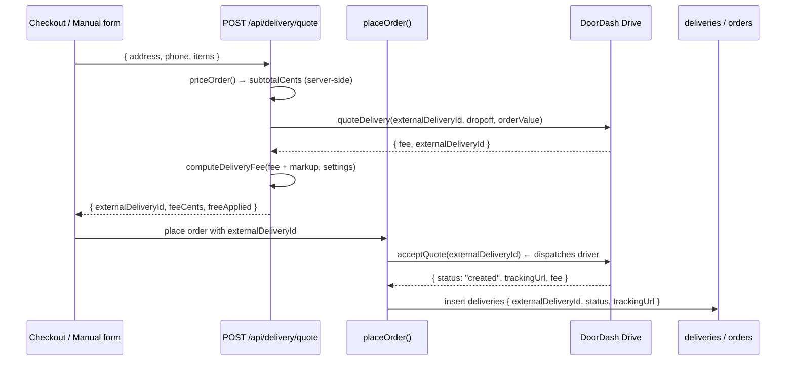

# DoorDash Drive Integration & Runbook

How Annapurna dispatches delivery drivers through **DoorDash Drive** (the
on-demand "Request a Delivery" API), tracks status, and shows customers a live
map. Read this with [`ARCHITECTURE.md`](./ARCHITECTURE.md) §6 (ordering pipeline).

The integration was sandbox-verified end-to-end on 2026-06-03. Going live is a
credential swap — see [§7 Production cutover](#7-production-cutover).

---

## 1. What DoorDash Drive gives us

A flat-fee on-demand courier. We send pickup (the restaurant) + dropoff (the
customer); DoorDash dispatches a Dasher and bills the merchant (~$7.99/delivery).

The flow is three calls plus a webhook:

1. **Quote** — price a delivery for a dropoff address.
2. **Accept** — accept the quote → **this dispatches the driver** and returns a
   tracking URL.
3. **Get delivery** — read current status on demand.
4. **Webhook** — DoorDash pushes status changes to us.

---

## 2. Files

| File | Responsibility |
|------|----------------|
| `src/lib/doordash/jwt.ts` | Mint the short-lived Drive JWT |
| `src/lib/doordash/client.ts` | `quoteDelivery`, `acceptQuote`, `getDelivery` + `DriveApiError` |
| `src/lib/doordash/types.ts` | Quote/accept I/O types |
| `src/lib/doordash/webhook.ts` | `verifyWebhookAuth`, `verifyWebhookSignature`, `parseEvent`, `mapDeliveryStatus` |
| `src/app/api/delivery/quote/route.ts` | Public quote endpoint (prices order, applies markup) |
| `src/app/api/doordash/webhook/route.ts` | Receives status events, updates DB |
| `src/lib/orders/place-order.ts` | Calls `acceptQuote` to dispatch, persists `deliveries` |
| `src/app/order/[id]/page.tsx` | Embeds the customer tracking map |

---

## 3. Authentication (JWT)

`createDriveJwt()` mints an HS256 JWT, signed with the **signing secret**
(URL-safe base64, decoded to bytes):

```
header:  { "alg": "HS256", "typ": "JWT", "dd-ver": "DD-JWT-V1" }
payload: { "aud": "doordash", "iss": <developerId>, "kid": <keyId>,
           "iat": now, "exp": now + 300 }
```

Five-minute lifetime; a fresh token is minted per request in `driveFetch`. Base
URL is `https://openapi.doordash.com` for **both** sandbox and production — the
**credentials** decide which environment you hit.

---

## 4. Dispatch flow



- **`externalDeliveryId`** is our idempotency key. Format is strict:
  `^anp-[0-9a-f-]{36}$` (i.e. `anp-` + a UUID). The quote route generates
  `anp-${randomUUID()}`.
- The customer is **never** charged the raw DoorDash fee — `computeDeliveryFee`
  applies the configured markup / flat fee / free-threshold (see
  `ARCHITECTURE.md` §8).
- If `acceptQuote` fails, `placeOrder` throws `OrderError(502)` and the order is
  not created.

---

## 5. Webhook (status updates)

`POST /api/doordash/webhook`. DoorDash calls this as the delivery progresses.

### Authentication — two supported modes

The DoorDash webhook portal authenticates by sending a **static Authorization
header** (a token you configure there), **not** an HMAC body signature. Our
handler accepts either, so it works regardless of how the webhook is set up:

```ts
const authed =
  verifyWebhookAuth(req.headers.get("authorization")) ||      // portal token model
  verifyWebhookSignature(raw, req.headers.get("x-doordash-signature")); // HMAC model
if (!authed) return 401;
```

- `verifyWebhookAuth` — constant-time compare of the bearer token (with optional
  `Bearer ` prefix stripped) to `DOORDASH_WEBHOOK_SECRET`.
- `verifyWebhookSignature` — base64 HMAC-SHA256 of the raw body vs.
  `x-doordash-signature`, keyed by the same secret.

> The token in the portal **is the same value** as `DOORDASH_WEBHOOK_SECRET`.
> We generate it locally and paste it into the portal — DoorDash does not
> hand us a webhook secret.

### Processing

1. Parse the event (`parseEvent`) → `external_delivery_id`, `delivery_status`,
   `tracking_url`, `event_id`.
2. Look up the `deliveries` row by `external_delivery_id`. Unknown → `200 ack`
   (so DoorDash stops retrying).
3. Dedup on `lastEventId === event_id`.
4. Update `deliveries.status` + `trackingUrl` + `raw`.
5. Map `delivery_status` → order status (`mapDeliveryStatus`) and, if
   `canTransition("delivery", current, mapped, "webhook")`, advance `orders.status`.

### Status mapping (`mapDeliveryStatus`)

| DoorDash `delivery_status` | Order status |
|----------------------------|--------------|
| `enroute_to_pickup`, `arrived_at_pickup`, `picked_up` | `courier_picked_up` |
| `enroute_to_dropoff`, `arrived_at_dropoff` | `en_route` |
| `delivered` | `delivered` |
| `cancelled` | `cancelled` |
| `created`, `confirmed` | *(no order change — early states)* |

Always returns `200` after a valid signature, even when nothing changes, so
DoorDash never retries a processed event.

---

## 6. Customer tracking map

`acceptQuote` saves `trackingUrl` to the `deliveries` row. `/order/[id]` renders
it two ways when the order is a delivery with a tracking URL:

- An **embedded iframe** of the DoorDash tracking page (live map + status).
  DoorDash serves `content-security-policy: frame-ancestors *`, so embedding is
  allowed (modern browsers honor this over the also-present
  `x-frame-options: SAMEORIGIN`).
- An **"Open fullscreen"** link to the same URL.

The order page itself is gated by the capability token (`?t=<accessToken>`).

---

## 7. Production cutover

The code is identical for sandbox and production — only credentials and the
webhook registration differ.

### Checklist

1. **Get production Drive credentials** from
   [developer.doordash.com](https://developer.doordash.com) → Developer →
   Credentials (Production). You need Developer ID, Key ID, Signing Secret.

2. **Swap the three creds** in `.env.local` and Vercel. To replace a Vercel var
   without echoing the value:
   ```bash
   npx vercel env rm DOORDASH_SIGNING_SECRET production --yes
   printf '%s' "$PROD_SIGNING_SECRET" | npx vercel env add DOORDASH_SIGNING_SECRET production
   # repeat for DOORDASH_DEVELOPER_ID and DOORDASH_KEY_ID
   ```
   `DOORDASH_WEBHOOK_SECRET` and `RESTAURANT_PICKUP_*` stay the same.

3. **Register the production webhook** in the DoorDash portal → Webhooks →
   **Production** tab → Add endpoint:
   - URL: `https://annapurnaoakland.vercel.app/api/doordash/webhook`
   - Active, All events
   - Authentication: **Bearer**, Header key `Authorization`
   - Authorization header: the value of `DOORDASH_WEBHOOK_SECRET`
     (`grep ^DOORDASH_WEBHOOK_SECRET= .env.local`)

4. **Redeploy** so functions pick up the new creds: `npx vercel --prod`.

5. **Confirm delivery settings** in `/admin/settings`: `delivery_enabled` on,
   sane `minOrderCents`, markup/flat fee, and `maxRadiusMiles`.

6. **Smoke test with a real, low-value order** to a nearby address. ⚠️ In
   production every accepted quote **dispatches a real Dasher and bills ~$7.99**.

### What changes in production

| Sandbox | Production |
|---------|------------|
| Store shows as `business_owner` | Your real Annapurna business name |
| Every address: "Address needs review" | Real geocoding/validation |
| Delivery never advances | Real Dasher → real webhooks → status flows |

---

## 8. Testing in sandbox

Both scripts hit the live Drive **sandbox** (safe; no real driver/charge) and
need the `server-only` shim.

```bash
# Quote only (free, safe):
NODE_OPTIONS="--require $(pwd)/scripts/_server-only-shim.cjs" \
  npx tsx --env-file=.env.local scripts/doordash-smoke.ts

# Quote → accept (dispatch) → status:
NODE_OPTIONS="--require $(pwd)/scripts/_server-only-shim.cjs" \
  npx tsx --env-file=.env.local scripts/doordash-smoke.ts --accept

# Full pipeline: place + persist an order, poll DB:
NODE_OPTIONS="--require $(pwd)/scripts/_server-only-shim.cjs" \
  npx tsx --env-file=.env.local scripts/doordash-e2e.ts
```

Override the dropoff with env vars:
`DROPOFF_ADDRESS="…" DROPOFF_PHONE="+1…" npx tsx … scripts/doordash-smoke.ts --accept`.

**Sandbox doesn't advance deliveries.** To exercise the webhook → DB path, POST
a signed event for a persisted order's `externalDeliveryId`:

```bash
SECRET=$(grep ^DOORDASH_WEBHOOK_SECRET= .env.local | cut -d= -f2-)
curl -s -X POST https://annapurnaoakland.vercel.app/api/doordash/webhook \
  -H "Authorization: Bearer $SECRET" -H "Content-Type: application/json" \
  -d '{"external_delivery_id":"anp-<uuid>","delivery_status":"picked_up","event_id":"'"$(uuidgen)"'"}'
```

`delivery_status` values that move the order: `picked_up`, `enroute_to_dropoff`,
`delivered`, `cancelled`.

---

## 9. Troubleshooting

| Symptom | Cause / fix |
|---------|-------------|
| Quote/accept throws "Missing required env var" | One of the 4 `DOORDASH_*` vars is unset; `env.doordash()` requires all four |
| `placeOrder` → "Invalid delivery reference" | `externalDeliveryId` not `anp-<uuid>`; must match `^anp-[0-9a-f-]{36}$` |
| Webhook returns 401 | Authorization header token ≠ `DOORDASH_WEBHOOK_SECRET`, or env not redeployed |
| Order stuck at `received`/`ready`, delivery `created` | No webhook events arrived (sandbox), or events were early states (`created`/`confirmed`) that map to no change |
| Customer DB shows `delivered` but DoorDash tracking doesn't | A manually POSTed test event updated our DB only; DoorDash's record is separate. Doesn't happen with real driver events |
| `DriveApiError 4xx/5xx` | Inspect `.body`; usually a bad address, expired/invalid creds, or sandbox/prod mismatch |
